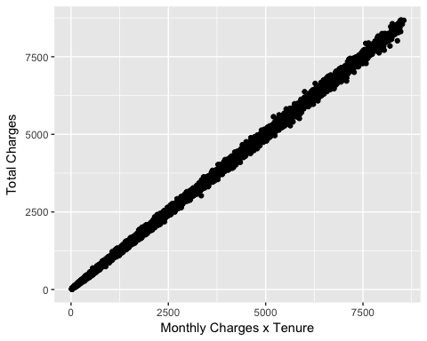
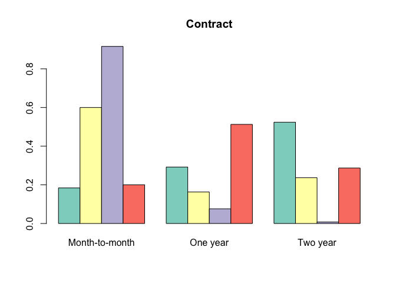
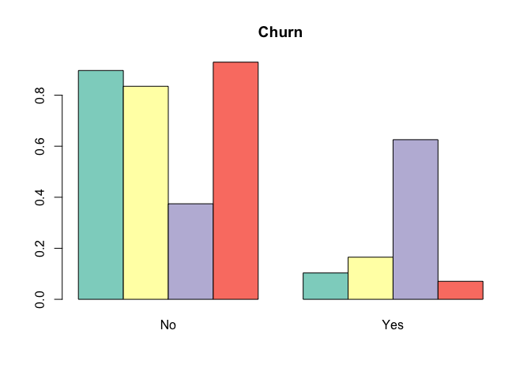

## Summary

In this project, the goal is to use a sample of publicly available customer data from telecommunications provider Telco to: **1) give an overview of their customer base; and 2) apply customer segmentation using the k-prototype clustering algorithm** - an extension of k-means clustering that can deal with non-numeric data. 

The analysis generated four clusters that have been labled as follows after exploration:  


+ Cluster 1: The super customer (likely couples with no kids)
+ Cluster 2: Basic new customer (likely young and on a budget)
+ Cluster 3: Unhappy & overcharged churned customers (likely single parents)
+ Cluster 4: Second best customer (likely young family on a budget)

## Loading packages


```r
library(dplyr)
library(ggplot2)
library(gridExtra)
library(RColorBrewer)
library(clustMixType)
```

## The Data

The data for this project is a sample of Telco's - a telecommunications operator - customer database made publicly available on [Kaggle](https://www.kaggle.com/blastchar/telco-customer-churn). 

Each row represents a customer, and each column contains customer’s attributes.The data set includes information about:

+ Customers who left within the last month – the column is called Churn
+ Services that each customer has signed up for – phone, multiple lines, internet, online security, online backup, device protection, tech support, and streaming TV and movies
+ Customer account information – how long they’ve been a customer, contract, payment method, paperless billing, monthly charges, and total charges
+ Demographic info about customers – gender, age range, and if they have partners and dependents

### Importing data  

```r
#creating folder for data
if(!file.exists('project_data')) {
  dir.create('project_data')
}

#importing data
data = read.csv('/Users/raqdom/DS_Projects/Clustering_Customers/WA_Fn-UseC_-Telco-Customer-Churn.csv', na.strings=c("", "NA"))
```

The data has 21 columns/customer variables and 7,043  rows/customers.  

```r
dim(data)
```

```
## [1] 7043   21
```

```r
head(data)
```

```
##   customerID gender SeniorCitizen Partner Dependents tenure PhoneService
## 1 7590-VHVEG Female             0     Yes         No      1           No
## 2 5575-GNVDE   Male             0      No         No     34          Yes
## 3 3668-QPYBK   Male             0      No         No      2          Yes
## 4 7795-CFOCW   Male             0      No         No     45           No
## 5 9237-HQITU Female             0      No         No      2          Yes
## 6 9305-CDSKC Female             0      No         No      8          Yes
##      MultipleLines InternetService OnlineSecurity OnlineBackup
## 1 No phone service             DSL             No          Yes
## 2               No             DSL            Yes           No
## 3               No             DSL            Yes          Yes
## 4 No phone service             DSL            Yes           No
## 5               No     Fiber optic             No           No
## 6              Yes     Fiber optic             No           No
##   DeviceProtection TechSupport StreamingTV StreamingMovies       Contract
## 1               No          No          No              No Month-to-month
## 2              Yes          No          No              No       One year
## 3               No          No          No              No Month-to-month
## 4              Yes         Yes          No              No       One year
## 5               No          No          No              No Month-to-month
## 6              Yes          No         Yes             Yes Month-to-month
##   PaperlessBilling             PaymentMethod MonthlyCharges TotalCharges
## 1              Yes          Electronic check          29.85        29.85
## 2               No              Mailed check          56.95      1889.50
## 3              Yes              Mailed check          53.85       108.15
## 4               No Bank transfer (automatic)          42.30      1840.75
## 5              Yes          Electronic check          70.70       151.65
## 6              Yes          Electronic check          99.65       820.50
##   Churn
## 1    No
## 2    No
## 3   Yes
## 4    No
## 5   Yes
## 6   Yes
```

The first 5 rows look as follows:

```r
head(data)
```

```
##   customerID gender SeniorCitizen Partner Dependents tenure PhoneService
## 1 7590-VHVEG Female             0     Yes         No      1           No
## 2 5575-GNVDE   Male             0      No         No     34          Yes
## 3 3668-QPYBK   Male             0      No         No      2          Yes
## 4 7795-CFOCW   Male             0      No         No     45           No
## 5 9237-HQITU Female             0      No         No      2          Yes
## 6 9305-CDSKC Female             0      No         No      8          Yes
##      MultipleLines InternetService OnlineSecurity OnlineBackup
## 1 No phone service             DSL             No          Yes
## 2               No             DSL            Yes           No
## 3               No             DSL            Yes          Yes
## 4 No phone service             DSL            Yes           No
## 5               No     Fiber optic             No           No
## 6              Yes     Fiber optic             No           No
##   DeviceProtection TechSupport StreamingTV StreamingMovies       Contract
## 1               No          No          No              No Month-to-month
## 2              Yes          No          No              No       One year
## 3               No          No          No              No Month-to-month
## 4              Yes         Yes          No              No       One year
## 5               No          No          No              No Month-to-month
## 6              Yes          No         Yes             Yes Month-to-month
##   PaperlessBilling             PaymentMethod MonthlyCharges TotalCharges
## 1              Yes          Electronic check          29.85        29.85
## 2               No              Mailed check          56.95      1889.50
## 3              Yes              Mailed check          53.85       108.15
## 4               No Bank transfer (automatic)          42.30      1840.75
## 5              Yes          Electronic check          70.70       151.65
## 6              Yes          Electronic check          99.65       820.50
##   Churn
## 1    No
## 2    No
## 3   Yes
## 4    No
## 5   Yes
## 6   Yes
```

The bulk of variables are categorical, except for tenure, monthly charges, total charges, and SerniorCitizen (which looks like a factor).

```r
str(data)
```

```
## 'data.frame':	7043 obs. of  21 variables:
##  $ customerID      : Factor w/ 7043 levels "0002-ORFBO","0003-MKNFE",..: 5376 3963 2565 5536 6512 6552 1003 4771 5605 4535 ...
##  $ gender          : Factor w/ 2 levels "Female","Male": 1 2 2 2 1 1 2 1 1 2 ...
##  $ SeniorCitizen   : int  0 0 0 0 0 0 0 0 0 0 ...
##  $ Partner         : Factor w/ 2 levels "No","Yes": 2 1 1 1 1 1 1 1 2 1 ...
##  $ Dependents      : Factor w/ 2 levels "No","Yes": 1 1 1 1 1 1 2 1 1 2 ...
##  $ tenure          : int  1 34 2 45 2 8 22 10 28 62 ...
##  $ PhoneService    : Factor w/ 2 levels "No","Yes": 1 2 2 1 2 2 2 1 2 2 ...
##  $ MultipleLines   : Factor w/ 3 levels "No","No phone service",..: 2 1 1 2 1 3 3 2 3 1 ...
##  $ InternetService : Factor w/ 3 levels "DSL","Fiber optic",..: 1 1 1 1 2 2 2 1 2 1 ...
##  $ OnlineSecurity  : Factor w/ 3 levels "No","No internet service",..: 1 3 3 3 1 1 1 3 1 3 ...
##  $ OnlineBackup    : Factor w/ 3 levels "No","No internet service",..: 3 1 3 1 1 1 3 1 1 3 ...
##  $ DeviceProtection: Factor w/ 3 levels "No","No internet service",..: 1 3 1 3 1 3 1 1 3 1 ...
##  $ TechSupport     : Factor w/ 3 levels "No","No internet service",..: 1 1 1 3 1 1 1 1 3 1 ...
##  $ StreamingTV     : Factor w/ 3 levels "No","No internet service",..: 1 1 1 1 1 3 3 1 3 1 ...
##  $ StreamingMovies : Factor w/ 3 levels "No","No internet service",..: 1 1 1 1 1 3 1 1 3 1 ...
##  $ Contract        : Factor w/ 3 levels "Month-to-month",..: 1 2 1 2 1 1 1 1 1 2 ...
##  $ PaperlessBilling: Factor w/ 2 levels "No","Yes": 2 1 2 1 2 2 2 1 2 1 ...
##  $ PaymentMethod   : Factor w/ 4 levels "Bank transfer (automatic)",..: 3 4 4 1 3 3 2 4 3 1 ...
##  $ MonthlyCharges  : num  29.9 57 53.9 42.3 70.7 ...
##  $ TotalCharges    : num  29.9 1889.5 108.2 1840.8 151.7 ...
##  $ Churn           : Factor w/ 2 levels "No","Yes": 1 1 2 1 2 2 1 1 2 1 ...
```

### Missing Data

In total, only the column 'TotalCharges' has missing information on 11 customers.

**NA count per column** 

```r
missing = sort(sapply(data, function(x) sum(is.na(x))))
missing[missing>0]
```

```
## TotalCharges 
##           11
```

A quick investigation of the data suggests that 'TotalCharges' is a function of 'MonthlyCharges' multiplied by 'tenure' (in months). For those missing values, tenure = 0 as presumably these are new customers that have not been charged yet. We can use this to replace NAs with zero when we clean the data.

**Total Charges**

```r
qplot(data$MonthlyCharges*data$tenure, data$TotalCharges, xlab='Monthly Charges x Tenure', ylab='Total Charges') #total charges = monthly charges * tenure but NA if tenure = 0
```

<!-- -->

### Cleaning data  

#### Imputing Missing Data

We will replace any NAs in 'TotalCharges' with zeros as described above.


```r
data2 = data %>% mutate(TotalCharges = ifelse(is.na(TotalCharges), 0, TotalCharges))
```

#### Variable Transformations  

Where more than two categories can be grouped for one variable, we will group them (i.e. for variable 'MultipleLines', we will group 'No' and 'No phone service') as follows:


```r
data2 = data2 %>% 
  mutate(SeniorCitizen = as.factor(ifelse(SeniorCitizen == 0, 'No', 'Yes')),
         MultipleLines = as.factor(ifelse(MultipleLines %in% c('No phone service', 'No'), 'No', 'Yes')),
         OnlineSecurity = as.factor(ifelse(OnlineSecurity %in% c('No internet service', 'No'), 'No', 'Yes')),
         OnlineBackup = as.factor(ifelse(OnlineBackup %in% c('No internet service', 'No'), 'No', 'Yes')),
         DeviceProtection = as.factor(ifelse(DeviceProtection %in% c('No internet service', 'No'), 'No', 'Yes')),
         TechSupport = as.factor(ifelse(TechSupport %in% c('No internet service', 'No'), 'No', 'Yes')),
         StreamingTV = as.factor(ifelse(StreamingTV %in% c('No internet service', 'No'), 'No', 'Yes')),
         StreamingMovies = as.factor(ifelse(StreamingMovies %in% c('No internet service', 'No'), 'No', 'Yes')))
```

## Exploratory Analysis

### Visualising The Customer Database  

The following charts summarise the customer dataset. A quick overview suggests: 

#### Demographic
* Even gender split;  
* A young customer base (only 16% Senior);  
* Even split in having a partner;  
* 30% have dependents.    
  
<!-- -->

#### Service use (from most to least popular) 
* 90% use phone service - this has the highest take up;  
* 78% use Telco's internet service (44% Fiber Optic; 34% DSL);
* 42% have multiple lines;
* 39% stream movies;
* 38% stream TV;
* 34% have online backup;
* 34% have device protection;
* 29% have online security;
* 29% use tech support.

<!-- -->

#### Customer account/lifetime value markers  
* Median tenure is 29 months; but the most common seems to be 1-2 months (i.e. new customers);
* Median monthly charges are £70; but the most popular range seems to be from £10 to £30/month.
* 26% of customers have churned in the last month;
* 59% use paperless billing;
* Month-to-Month contracts are the most popular (55% of customers), followed by two-year contracts (24%).

<!-- -->

### Mapping/Visualising Telco's best customers  
  
An ideal customer here will be defined in lifetime value terms: someone whose average spend is high (measured by monthly charges); and whose lifetime with the company is long (tenure). 

The assumption is that Telco would want to maximise customer lifetime value, and wants to understand its drivers so it can improve it (i.e.: through marketing/service offers).

#### Customer Scatterplots  
To visualise this, we will plot each customer (represented by the dots) alongside monthly charges and tenure, and overlay each variable to bring out any pattern. For clearer visualisation, the median tenure/monthly charges are added. 

In theory, Telco would want every customer to be in the top right quadrant (high charges/high loyalty), and might deploy campaigns designed to move customers from one quadrant to the other.

##### Key insights  
* Generally, amount charged not strongly correlated with tenure; customers in the most common/lowest monthly charge range (< £30) are spread across tenure axis; however  
* Churned customers are more likely to have high monthly charges and low tenure;  
* Senior customers likely to be charged more;
* Customers with partners more likely to have higher tenure & have higher charges;  
* Customers using multiple services are more likely to be in top right quadrant: Multiple Lines, Online Security etc...;  
* Month-to-month contracts yield lowest tenure vs two-year.  

<!-- -->

## Customer Segmentation

Clustering with customer data - or customer segmentation -  is used to group individuals so that customers in the same group or cluster are more similar to each other than those in other groups/clusters.

### k-Prototypes Clustering  

K-means is a simple unsupervised machine learning algorithm that groups data into a specified number (k) of clusters. It searches for a a partition of the data into k clusters that minimises the within groups sum of squared errors - this is the sum of the squared differences between each observation and its group's mean, and can be used as a measure of variation within a cluster. If all cases within a cluster are identical the sum of squared errors would then be equal to 0. 

However, k-means only works on numeric data. Since here we have factor variables, we will use the k-prototypes algorithm, which is an extension of k-means to deal with categorical data. More info available in [Zhexue Huang's paper](http://www.cs.ust.hk/~qyang/Teaching/537/Papers/huang98extensions.pdf).

### Data pre-processing

Before applying clustering to the data, let's standardise numeric variables so they're on the same scale and get rid of the customerID column, which isn't useful in clustering.


```r
data_std = data2 %>%
  mutate_if(is.numeric, scale) %>% #scaling numeric variables
  select(-customerID) #taking out customerID so it's not used in clustering
```

### How many clusters?

This algorithm requires us to input the number of clusters we want to group our customers into. To guide this decision, we will save down the values of the within groups sum of squared errors (SSE) against the number of clusters (1 to 10).

Known as the 'elbow' method, the idea is that the chart (tends to look like an arm) will show us where we would start to have diminishing returns. We want to choose a small value of k that still has low SSE.

From looking at this chart, we will stick to grouping customers into 4 clusters.


```r
set.seed(123)
wss = sapply(1:10, function(k){kproto(data_std, k, verbose = FALSE)$tot.withinss})
```


```r
# Total within-cluster sum of squares vs Choice of k
qplot(1:10, wss, geom=c('point', 'line'),xlab='Clusters', ylab='Within-cluster sum of squares')
```

<!-- -->

### Applying k-Prototypes

Now that we know we want four clusters, we can run the k-prototypes algorithm on the customer data.


```r
set.seed(123)
data_k4 <- kproto(data_std, 4)
```

This has grouped customers into four clusters, with the following number of customers in each:


```r
data_k4$size
```

```
## clusters
##    1    2    3    4 
## 1462 2810 1907  864
```

## The Clusters

We can now explore the properties of each cluster in relation to our variables, and start painting a picture of who these groups could describe so they could be used strategically by the business. 

### Cluster summaries

Having explore the profiles (plots below), they could be summarised as follows: 

##### Cluster 1: The super customer (couples with no kids)
* Highest tenure & monthly charges - not likely to be churned;
* Most likely to be multi-service users/use bulk of services on offer, have fiber optic internet, and two-year contract;
* Likely to: be in a partnership/no kids/even gender split but skewed towards female/not senior citizen.

##### Cluster 2: Basic new customer (young on a budget)
* Lowest tenure (new customer?) & monthly charges, but not likely to be churned;
* Most likely to only use phone service, and have month-to-month contract;
* Likely to: be single/no kids/younger/even gender split.

##### Cluster 3: Unhappy & overcharged churned customers
* Lowest tenure and second highest monthly charges; likely to be churned.
* Least likely to use extra services except for more 'modern' ones like TV/Movie streaming, and fiber optic internet, with month-to-month contract. 
* Likely to: be older, single, with dependents, even gender split.

##### Cluster 4: Second best customer (young family on a budget)
* Second highest tenure and second lowest monthly charges; not likely to be churned.
* Second most likely to be multi-service user, with one-year contract. 
* Likely to: be younger, in partnership, with dependents, even gender split but skewed towarads male.


### Cluster profile plots  

**Cluster % customer split per variable**

```r
clprofiles(data_k4, data_std)
```

<!-- --><!-- --><!-- --><!-- --><!-- --><!-- --><!-- --><!-- --><!-- --><!-- --><!-- --><!-- --><!-- --><!-- --><!-- --><!-- --><!-- --><!-- --><!-- --><!-- -->


