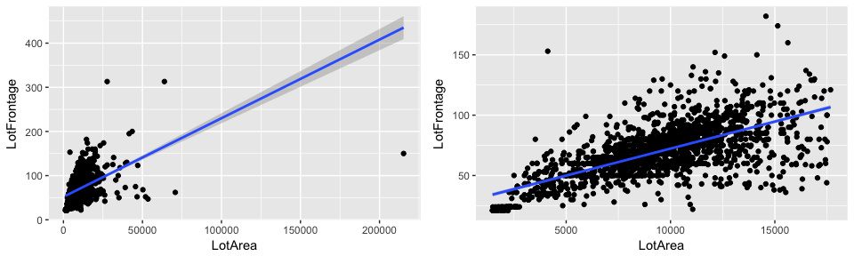

## Summary

In this project, the goal is to use house price data (availabe through [Kaggle](https://www.kaggle.com/c/house-prices-advanced-regression-techniques) from homes in Ames, Iowa) to create a model that will help predict house prices based on an original 79 house features.

Four regression models are built: 1) random forest; 2) ridge regression; 3) lasso regression; and 4) elastic net using k-fold cross validation with 5 samples. Random forest was the best performer, generating the lowest median root mean square error of all models across resamples.

## Loading packages


```r
library(dplyr)
library(ggplot2)
library(gridExtra)
library(RColorBrewer)
library(kableExtra)
library(magrittr)
library(caret)
library(xtable)
library(rpart)
library(rpart.plot)
library(parallel)
library(doParallel)
library(sqldf)
library(corrplot)
options(scipen=999) #taking off scientific notation for nicer plots
```

## The Data

The data for this project comes from Kaggle: <https://www.kaggle.com/c/house-prices-advanced-regression-techniques>. 

This dataset consists of 79 explanatory variables describing (almost) every aspect of residential homes in Ames, Iowa. Variables range from different size measures, to quality ratings, to neighborhood.

**Importing Data**

```r
#creating folder for data
if(!file.exists('data')) {
  dir.create('data')
}

#importin training set
train <- tbl_df(read.csv("/Users/raqdom/DS_Projects/Housing_Prices/data/train.csv", stringsAsFactors=FALSE))

#importing testing set
test <- tbl_df(read.csv("/Users/raqdom/DS_Projects/Housing_Prices/data/test.csv", stringsAsFactors=FALSE))
```

**Data size & variables**  

The training set has observations for 1,460 houses, and the test for 1,469 houses. As above, there are 79 explanatory variables, one ID column, and the response variable 'SalePrice', which is missing in the test data. 

```r
dim(train)
```

```
## [1] 1460   81
```

```r
dim(test)
```

```
## [1] 1459   80
```

The variables in the data are a mix of integer and character variables.

```r
str(train)
```

```
## Classes 'tbl_df', 'tbl' and 'data.frame':	1460 obs. of  81 variables:
##  $ Id           : int  1 2 3 4 5 6 7 8 9 10 ...
##  $ MSSubClass   : int  60 20 60 70 60 50 20 60 50 190 ...
##  $ MSZoning     : chr  "RL" "RL" "RL" "RL" ...
##  $ LotFrontage  : int  65 80 68 60 84 85 75 NA 51 50 ...
##  $ LotArea      : int  8450 9600 11250 9550 14260 14115 10084 10382 6120 7420 ...
##  $ Street       : chr  "Pave" "Pave" "Pave" "Pave" ...
##  $ Alley        : chr  NA NA NA NA ...
##  $ LotShape     : chr  "Reg" "Reg" "IR1" "IR1" ...
##  $ LandContour  : chr  "Lvl" "Lvl" "Lvl" "Lvl" ...
##  $ Utilities    : chr  "AllPub" "AllPub" "AllPub" "AllPub" ...
##  $ LotConfig    : chr  "Inside" "FR2" "Inside" "Corner" ...
##  $ LandSlope    : chr  "Gtl" "Gtl" "Gtl" "Gtl" ...
##  $ Neighborhood : chr  "CollgCr" "Veenker" "CollgCr" "Crawfor" ...
##  $ Condition1   : chr  "Norm" "Feedr" "Norm" "Norm" ...
##  $ Condition2   : chr  "Norm" "Norm" "Norm" "Norm" ...
##  $ BldgType     : chr  "1Fam" "1Fam" "1Fam" "1Fam" ...
##  $ HouseStyle   : chr  "2Story" "1Story" "2Story" "2Story" ...
##  $ OverallQual  : int  7 6 7 7 8 5 8 7 7 5 ...
##  $ OverallCond  : int  5 8 5 5 5 5 5 6 5 6 ...
##  $ YearBuilt    : int  2003 1976 2001 1915 2000 1993 2004 1973 1931 1939 ...
##  $ YearRemodAdd : int  2003 1976 2002 1970 2000 1995 2005 1973 1950 1950 ...
##  $ RoofStyle    : chr  "Gable" "Gable" "Gable" "Gable" ...
##  $ RoofMatl     : chr  "CompShg" "CompShg" "CompShg" "CompShg" ...
##  $ Exterior1st  : chr  "VinylSd" "MetalSd" "VinylSd" "Wd Sdng" ...
##  $ Exterior2nd  : chr  "VinylSd" "MetalSd" "VinylSd" "Wd Shng" ...
##  $ MasVnrType   : chr  "BrkFace" "None" "BrkFace" "None" ...
##  $ MasVnrArea   : int  196 0 162 0 350 0 186 240 0 0 ...
##  $ ExterQual    : chr  "Gd" "TA" "Gd" "TA" ...
##  $ ExterCond    : chr  "TA" "TA" "TA" "TA" ...
##  $ Foundation   : chr  "PConc" "CBlock" "PConc" "BrkTil" ...
##  $ BsmtQual     : chr  "Gd" "Gd" "Gd" "TA" ...
##  $ BsmtCond     : chr  "TA" "TA" "TA" "Gd" ...
##  $ BsmtExposure : chr  "No" "Gd" "Mn" "No" ...
##  $ BsmtFinType1 : chr  "GLQ" "ALQ" "GLQ" "ALQ" ...
##  $ BsmtFinSF1   : int  706 978 486 216 655 732 1369 859 0 851 ...
##  $ BsmtFinType2 : chr  "Unf" "Unf" "Unf" "Unf" ...
##  $ BsmtFinSF2   : int  0 0 0 0 0 0 0 32 0 0 ...
##  $ BsmtUnfSF    : int  150 284 434 540 490 64 317 216 952 140 ...
##  $ TotalBsmtSF  : int  856 1262 920 756 1145 796 1686 1107 952 991 ...
##  $ Heating      : chr  "GasA" "GasA" "GasA" "GasA" ...
##  $ HeatingQC    : chr  "Ex" "Ex" "Ex" "Gd" ...
##  $ CentralAir   : chr  "Y" "Y" "Y" "Y" ...
##  $ Electrical   : chr  "SBrkr" "SBrkr" "SBrkr" "SBrkr" ...
##  $ X1stFlrSF    : int  856 1262 920 961 1145 796 1694 1107 1022 1077 ...
##  $ X2ndFlrSF    : int  854 0 866 756 1053 566 0 983 752 0 ...
##  $ LowQualFinSF : int  0 0 0 0 0 0 0 0 0 0 ...
##  $ GrLivArea    : int  1710 1262 1786 1717 2198 1362 1694 2090 1774 1077 ...
##  $ BsmtFullBath : int  1 0 1 1 1 1 1 1 0 1 ...
##  $ BsmtHalfBath : int  0 1 0 0 0 0 0 0 0 0 ...
##  $ FullBath     : int  2 2 2 1 2 1 2 2 2 1 ...
##  $ HalfBath     : int  1 0 1 0 1 1 0 1 0 0 ...
##  $ BedroomAbvGr : int  3 3 3 3 4 1 3 3 2 2 ...
##  $ KitchenAbvGr : int  1 1 1 1 1 1 1 1 2 2 ...
##  $ KitchenQual  : chr  "Gd" "TA" "Gd" "Gd" ...
##  $ TotRmsAbvGrd : int  8 6 6 7 9 5 7 7 8 5 ...
##  $ Functional   : chr  "Typ" "Typ" "Typ" "Typ" ...
##  $ Fireplaces   : int  0 1 1 1 1 0 1 2 2 2 ...
##  $ FireplaceQu  : chr  NA "TA" "TA" "Gd" ...
##  $ GarageType   : chr  "Attchd" "Attchd" "Attchd" "Detchd" ...
##  $ GarageYrBlt  : int  2003 1976 2001 1998 2000 1993 2004 1973 1931 1939 ...
##  $ GarageFinish : chr  "RFn" "RFn" "RFn" "Unf" ...
##  $ GarageCars   : int  2 2 2 3 3 2 2 2 2 1 ...
##  $ GarageArea   : int  548 460 608 642 836 480 636 484 468 205 ...
##  $ GarageQual   : chr  "TA" "TA" "TA" "TA" ...
##  $ GarageCond   : chr  "TA" "TA" "TA" "TA" ...
##  $ PavedDrive   : chr  "Y" "Y" "Y" "Y" ...
##  $ WoodDeckSF   : int  0 298 0 0 192 40 255 235 90 0 ...
##  $ OpenPorchSF  : int  61 0 42 35 84 30 57 204 0 4 ...
##  $ EnclosedPorch: int  0 0 0 272 0 0 0 228 205 0 ...
##  $ X3SsnPorch   : int  0 0 0 0 0 320 0 0 0 0 ...
##  $ ScreenPorch  : int  0 0 0 0 0 0 0 0 0 0 ...
##  $ PoolArea     : int  0 0 0 0 0 0 0 0 0 0 ...
##  $ PoolQC       : chr  NA NA NA NA ...
##  $ Fence        : chr  NA NA NA NA ...
##  $ MiscFeature  : chr  NA NA NA NA ...
##  $ MiscVal      : int  0 0 0 0 0 700 0 350 0 0 ...
##  $ MoSold       : int  2 5 9 2 12 10 8 11 4 1 ...
##  $ YrSold       : int  2008 2007 2008 2006 2008 2009 2007 2009 2008 2008 ...
##  $ SaleType     : chr  "WD" "WD" "WD" "WD" ...
##  $ SaleCondition: chr  "Normal" "Normal" "Normal" "Abnorml" ...
##  $ SalePrice    : int  208500 181500 223500 140000 250000 143000 307000 200000 129900 118000 ...
```

For data cleaning and exploratory analysis, we'll combine training & test data:

```r
test = mutate(test, SalePrice = NA) #adding Y column to match train
full = train %>% bind_rows(test) 
```

### The Response Variable

We will be trying to predict house prices ('SalePrice'). The average house price in the data is $180,921, with a median of $163,000 and a few very expensive houses.

A quick look at which numeric variables are initially correlated with SalePrice revelas that the overall quality of the house, measure of size (in square feet) for the house and garage, as well as number of rooms and bathrooms are all highly correlated with price.

**Plot & summary of SalePrice **  

```
##    Min. 1st Qu.  Median    Mean 3rd Qu.    Max.    NA's 
##   34900  129975  163000  180921  214000  755000    1459
```

<!-- -->

**Correlation between SalePrice & numeric variables**  
<!-- -->

## Missing Data

In total, there are 34 explanatory variables with NAs in our data. Some missing the bulk of observations, and some missing only one or two.

**NA count per column** 

```
##  Exterior1st  Exterior2nd   BsmtFinSF1   BsmtFinSF2    BsmtUnfSF 
##            1            1            1            1            1 
##  TotalBsmtSF   Electrical  KitchenQual   GarageCars   GarageArea 
##            1            1            1            1            1 
##     SaleType    Utilities BsmtFullBath BsmtHalfBath   Functional 
##            1            2            2            2            2 
##     MSZoning   MasVnrArea   MasVnrType BsmtFinType1 BsmtFinType2 
##            4           23           24           79           80 
##     BsmtQual     BsmtCond BsmtExposure   GarageType  GarageYrBlt 
##           81           82           82          157          159 
## GarageFinish   GarageQual   GarageCond  LotFrontage  FireplaceQu 
##          159          159          159          486         1420 
##    SalePrice        Fence        Alley  MiscFeature       PoolQC 
##         1459         2348         2721         2814         2909
```

### Data Imputation Strategy

Depending on the variable, we will deal with them in the following ways, after having carefully looked at the data documentation: 

1. **Replace NA with 'None' where NA means feature missing**: from documenentation, bulk of NA observations are from variables were NA means that house lacks that feature. 

2. **LotFrontage (*linear feet of street connected to property*)**: imputed by predicting with LotArea with linear regression.

3. **GarageYrBlt**: where missing it will be replaced by the year the house was built.

4. **MasVnrArea & MasVnrType**: substitute with 'none' where houses don't have masonry even though documentation doesn't specifiy.

5. **Impute with mode/median**: rest of missing values will be imputed using simple mode (for character vars)/ median (for quantitative vars).

**1. Replacing NAs with 'None' where NA means feature lacking**

Documentation with factor level descriptions available [here](https://www.kaggle.com/c/house-prices-advanced-regression-techniques/data) from Kaggle.  

```r
full <- full %>%
  mutate(PoolQC = ifelse(is.na(PoolQC), 'None', PoolQC)) %>%
  mutate(MiscFeature = ifelse(is.na(MiscFeature), 'None', MiscFeature)) %>%
  mutate(Alley = ifelse(is.na(Alley), 'None', Alley)) %>%
  mutate(Fence = ifelse(is.na(Fence), 'None', Fence)) %>%
  mutate(FireplaceQu = ifelse(is.na(FireplaceQu), 'None', FireplaceQu)) %>%
  mutate(GarageFinish = ifelse(is.na(GarageFinish), 'None', GarageFinish)) %>%
  mutate(GarageQual = ifelse(is.na(GarageQual), 'None', GarageQual)) %>%
  mutate(GarageCond = ifelse(is.na(GarageCond), 'None', GarageCond)) %>%
  mutate(GarageType = ifelse(is.na(GarageType), 'None', GarageType)) %>%
  mutate(BsmtCond = ifelse(is.na(BsmtCond), 'None', BsmtCond)) %>%
  mutate(BsmtExposure = ifelse(is.na(BsmtExposure), 'None', BsmtExposure)) %>%
  mutate(BsmtQual = ifelse(is.na(BsmtQual), 'None', BsmtQual)) %>%
  mutate(BsmtFinType2 = ifelse(is.na(BsmtFinType2), 'None', BsmtFinType2)) %>%
  mutate(BsmtFinType1 = ifelse(is.na(BsmtFinType1), 'None', BsmtFinType1))
```

Bulk of missing data is now gone. 

**NA count per column** 

```
##    SalePrice  LotFrontage  GarageYrBlt   MasVnrType   MasVnrArea 
##         1459          486          159           24           23 
##     MSZoning    Utilities BsmtFullBath BsmtHalfBath   Functional 
##            4            2            2            2            2 
##  Exterior1st  Exterior2nd   BsmtFinSF1   BsmtFinSF2    BsmtUnfSF 
##            1            1            1            1            1 
##  TotalBsmtSF   Electrical  KitchenQual   GarageCars   GarageArea 
##            1            1            1            1            1 
##     SaleType 
##            1
```

 **2. Imputing LotFrontage through simple linear regression**  
 
LotFrontage is most highly correlated with LotArea, which has no data missing. We will use this to predict NAs in LotFrontage using a simple linear regression model. 

The model would predict as follows, with and without outliers:

 
<!-- -->

We'll use the data without outliers to fit our linear model and pass our model predictions to our full dataset as follows: 

```r
#model
LotFrontageLM <- lm(LotFrontage ~ LotArea, data=full_lot)

#save predictins
Prediction <- predict(LotFrontageLM, full) 

#use prediction to replace NAs in our data
full <- full %>% 
  mutate (LotFrontageLM = Prediction) %>%
  mutate (LotFrontage = round(ifelse(is.na(LotFrontage), LotFrontageLM, LotFrontage))) %>%
  select(-LotFrontageLM)
```

**3. GarageYrBlt**

Where GarageYrBlt exists in the dataset, it is commonly (in 2,216 out of 2,919 of cases) the same as the year the house was built (YearBuilt). Therefore, where it is missing, we will impute the house year built instead.

```r
nrow(full %>% filter(GarageYrBlt == YearBuilt))
```

```
## [1] 2216
```

```r
full <- full %>% mutate (GarageYrBlt = round(ifelse(is.na(GarageYrBlt), YearBuilt, GarageYrBlt)))
```

**4. MasVnrArea & MasVnrType**

These two masonry variables (area & type) seem to be missing together, so it's reasonable to conclude the house has no masonry. If both are missing, we will impute 'None' where there are missing values. 

```r
full <- full %>%
  mutate(MasVnrArea = ifelse(is.na(MasVnrArea), 0, MasVnrArea)) %>%
  mutate(MasVnrType = ifelse(MasVnrArea == 0, 'None', MasVnrType))
```

We have now dealt with the majority of missing data. 

**NA count per column** 

```r
missing_3 = sort(sapply(full, function(x) sum(is.na(x))))
missing_3[missing_3>0]
```

```
##  Exterior1st  Exterior2nd   MasVnrType   BsmtFinSF1   BsmtFinSF2 
##            1            1            1            1            1 
##    BsmtUnfSF  TotalBsmtSF   Electrical  KitchenQual   GarageCars 
##            1            1            1            1            1 
##   GarageArea     SaleType    Utilities BsmtFullBath BsmtHalfBath 
##            1            1            2            2            2 
##   Functional     MSZoning    SalePrice 
##            2            4         1459
```

**5. Inputing Mode/Median for rest of variables**  

The few remaining missing values, we'll replace with mode (if factor) and median (if continuos) of column.


```r
Mode <- function(x) {
  ux <- unique(x)
  ux[which.max(tabulate(match(x, ux)))]
} 

full <- full %>% 
  mutate(Exterior1st = ifelse(is.na(Exterior1st), Mode(Exterior1st), Exterior1st)) %>%
  mutate(Exterior2nd = ifelse(is.na(Exterior2nd), Mode(Exterior2nd), Exterior2nd)) %>%  
  mutate(MasVnrType = ifelse(is.na(MasVnrType), Mode(MasVnrType), MasVnrType)) %>%  
  mutate(BsmtFinSF1 = ifelse(is.na(BsmtFinSF1), median(BsmtFinSF1, na.rm = TRUE), BsmtFinSF1)) %>%  
  mutate(BsmtFinSF2 = ifelse(is.na(BsmtFinSF2), median(BsmtFinSF2, na.rm = TRUE), BsmtFinSF2)) %>%  
  mutate(BsmtUnfSF = ifelse(is.na(BsmtUnfSF), median(BsmtUnfSF, na.rm = TRUE), BsmtUnfSF)) %>%  
  mutate(TotalBsmtSF = ifelse(is.na(TotalBsmtSF), median(TotalBsmtSF, na.rm = TRUE), TotalBsmtSF)) %>%  
  mutate(Electrical = ifelse(is.na(Electrical), Mode(Electrical), Electrical)) %>%  
  mutate(KitchenQual = ifelse(is.na(KitchenQual), Mode(KitchenQual), KitchenQual)) %>%  
  mutate(GarageCars = ifelse(is.na(GarageCars), Mode(GarageCars), GarageCars)) %>%    
  mutate(GarageArea = ifelse(is.na(GarageArea), median(GarageArea, na.rm = TRUE), GarageArea)) %>%  
  mutate(SaleType = ifelse(is.na(SaleType), Mode(SaleType), SaleType)) %>%    
  mutate(Utilities = ifelse(is.na(Utilities), Mode(Utilities), Utilities)) %>%      
  mutate(BsmtFullBath = ifelse(is.na(BsmtFullBath), median(BsmtFullBath, na.rm = TRUE), BsmtFullBath)) %>%  
  mutate(BsmtHalfBath = ifelse(is.na(BsmtHalfBath), median(BsmtHalfBath, na.rm = TRUE), BsmtHalfBath)) %>%  
  mutate(Functional = ifelse(is.na(Functional), Mode(Functional), Functional)) %>%    
  mutate(MSZoning = ifelse(is.na(MSZoning), Mode(MSZoning), MSZoning))
```

**Final NA count per column** 

```r
missing_4 = sort(sapply(full, function(x) sum(is.na(x))))
missing_4[missing_4>0]
```

```
## SalePrice 
##      1459
```

The data has been cleaned of missing values and is now ready for analysis.

## Exploratory Analysis

Let's look at the correlation between numeric variables and those most highly correlated with SalePrice again. Later on, we'll have to get rid of highly correlated variables.  

Through visualisation, the relationship between SalePrice and these variables is very clear.

**Correlation between numeric variables**
<!-- -->


**Explanatory variable plots**  
  
    
<!-- -->

There are also other common sense factor variables in the data that are linked to SalePrice: for example neighbourhood,  whether the house has central air or garage finish.

**Neighborhood, Central Air & Garage Finish plots**  

  
<!-- -->
  
  
  
<!-- -->
  

## Feature Engineering

Having explored the data, from existing variables we will create the following that might be helpful in modelling later: 

+ The total number of baths, since the data only provides basement and above ground full and half baths separately, and bathrooms seem to be quite important.

+ Total square feet of the house, since size is important and basement size is given separately in original data.

+ The age of the house at point of sale, since we know when it was built.


```r
full_2 <- full %>%
  mutate(TotalBaths = BsmtFullBath + (0.5 * BsmtHalfBath) + FullBath + (0.5 * HalfBath)) %>%
  mutate(TotalSqFeet = GrLivArea + TotalBsmtSF) %>%
  mutate(Age = YrSold - YearBuilt)
```

**New Variables vs SalePrice**
<!-- -->


## Final Data Cleaning

### Dropping highly correlated variables

We will drop highly correlated variables while keeping the ones most highly correlated with SalePrice as follows.


```r
#generate list variables that are highly correlated with each other
cor_list <- as.data.frame(as.table(cor2)) %>% 
  filter(abs(Freq) > 0.6 & abs(Freq) != 1.00) %>%
  arrange(desc(Freq))

#generate separate list of variables highly correlated with SalePrice
cor_saleprice <- as.data.frame(cor2) %>% 
  select(SalePrice) %>%
  mutate(feature = as.character(rownames(cor))) %>%
  mutate(cor = SalePrice) %>%
  arrange(desc(cor)) %>%
  filter(feature != "SalePrice")

#drop highly correlated variables & some of the direct inputs into new features, but keeping the one more highly correlated with SalePrice. Also turn character variables into factors.
full_2 <- full_2 %>%
  select(-GarageArea, -GarageYrBlt, -TotRmsAbvGrd, -GrLivArea, -TotalBsmtSF, -BsmtFullBath, -BsmtHalfBath, -FullBath, - HalfBath, -LotFrontage) %>%
  mutate_if(is.character,as.factor)
```

### Standardising data

Because some of our regression models are affected by the scale of the predictors (i.e. ridge), we will standardise our numerical explanatory variables, as the penalization will then treat different explanatory variables on a more equal footing. This means that the final fit will not depend on the predictors' scale.


```r
#separating train and test sets
train_2 <- full_2 %>% filter(!is.na(SalePrice))
test_2 <- full_2 %>% filter(is.na(SalePrice))

## standardising predictors 
preProc <- preProcess(train_2[,-71], method = c("center", "scale")) #predictors that are not numeric are ignored in the calculations.

#final train and test datasets for modelling
train_3 <- predict(preProc, train_2)
test_3 <- predict(preProc, test_2)
```

## Modelling 

For our regression exercise, we will fit four different types of models for comparison: 1) random forest, 2) ridge regression, 3) lasso regression, and 4) elastic net.

For modelling, the Caret R package will be used, as it provides a consistent interface to all of R's most powerful machine learning models and is helpful in automatically choosing the best tuning parameter values, computing the final model and evaluating the model performance using cross-validation techniques.

### Cross Validation Settings

Instead of using Caret's default settings, to estimate the accuracy of our trained models and avoid overfitting, we will use k-fold cross validation on 5 subsets.

The k-fold cross validation method splits the dataset into k-subsets, then each subset is held out while the model is trained on all other subsets. This goes on until accuracy is determine for each instance in the data, and an overall accuracy estimate is provided.


```r
#configure trainControl object with our cross-validation method
fitControl <- trainControl(method = "cv",
                           number = 5,
                           allowParallel = TRUE)
```

### Model 1: Random Forest  

Random forests train a large number of "strong" decision trees and combine their predictions through bagging. There are also two sources of "randomness" for random forests: 1) Each tree is only allowed to choose from a random subset of features to split on (leading to feature selection); and 2) Each tree is only trained on a random subset of observations (resampling).

To improve response time on random forest, we will use parallel processing. Caret supports the parallel processing capabilities of the parallel package. This  allow to run models in parallel to obtain a manageable response time. 

**Fitting the model**

```r
set.seed(111)

#Step1: Configure parallel processing
cluster = makeCluster(detectCores() - 1) #convention to leave 1 core for OS
registerDoParallel(cluster)

#Step 2: Build model
fit_rf = train(SalePrice ~.,
               data=train_3, 
               method='rf',
               trControl=fitControl, 
               importance=TRUE
              )

#Step 3: De-register parallel processing cluster 
stopCluster(cluster)
registerDoSEQ()
```

**Performance across resamples**

```r
fit_rf$resample
```

```
##       RMSE  Rsquared      MAE Resample
## 1 27121.32 0.8884932 17511.40    Fold1
## 2 39876.61 0.7950286 18415.79    Fold3
## 3 23635.15 0.9159446 15677.08    Fold2
## 4 29255.27 0.8599779 17342.23    Fold5
## 5 23171.02 0.9036707 14908.16    Fold4
```

### Model 2: Ridge Regression

Penalised regression allows to create a linear regression model that is penalized for having too many variables in the model, by adding a constraint in the equation. This leads to shrink the coefficient values towards zero. This allows the less contributive variables to have a coefficient close to zero or equal zero.

Ridge regression shrinks the regression coefficients, so that variables with minor contribution to the outcome have their coefficients close to zero.

The shrinkage of the coefficients is achieved by penalizing the regression model with a penalty term called L2-norm, which is the sum of the squared coefficients. The amount of the penalty can be fine-tuned using a constant called lambda (λ). Selecting a good value for λ is critical.

**Fitting the model**

```r
#Step 1: setup a grid range of lambda values
lambda <- 10^seq(-3, 3, length = 100)

#Step 2: compute ridge regression:
set.seed(111)
fit_ridge <- train(SalePrice ~., 
                   data = train_3, 
                   method = 'glmnet',
                   tuneGrid = expand.grid(alpha = 0, lambda = lambda),
                   trControl = fitControl
                   )
```

**Performance across resamples**

```r
fit_ridge$resample
```

```
##       RMSE  Rsquared      MAE Resample
## 1 28920.13 0.8643157 18958.85    Fold2
## 2 34668.30 0.8007023 19581.03    Fold5
## 3 26347.98 0.8751971 17556.47    Fold4
## 4 28842.36 0.8686401 18438.74    Fold1
## 5 51738.66 0.6902298 18867.37    Fold3
```

### Model 3: Lasso Regression

Lasso stands for Least Absolute Shrinkage and Selection Operator. It shrinks the regression coefficients toward zero by penalizing the regression model with a penalty term called L1-norm, which is the sum of the absolute coefficients.

In the case of lasso regression, the penalty has the effect of forcing some of the coefficient estimates, with a minor contribution to the model, to be exactly equal to zero. This means that, lasso can be also seen as an alternative to the subset selection methods for performing variable selection in order to reduce the complexity of the model.

As in ridge regression, selecting a good value of λ for the lasso is critical.

**Fitting the model**

```r
set.seed(111)

fit_lasso <- train(SalePrice ~., 
                   data = train_3, 
                   method = 'glmnet', 
                   trControl = fitControl, 
                   tuneGrid = expand.grid(alpha = 1, lambda = lambda))
```

**Performance across resamples**

```r
fit_lasso$resample
```

```
##       RMSE  Rsquared      MAE Resample
## 1 28655.24 0.8683527 18074.68    Fold2
## 2 35665.11 0.7878486 19153.30    Fold5
## 3 24554.38 0.8886556 16360.43    Fold4
## 4 28206.73 0.8770312 17908.92    Fold1
## 5 51377.53 0.6860197 19280.66    Fold3
```

### Model 4: Elastic Net

Elastic-Net is a compromise between Lasso and Ridge - it is penalized with both the L1-norm and L2-norm. The consequence of this is to effectively shrink coefficients (like in ridge regression) and to set some coefficients to zero (as in LASSO).

**Fitting the model**

```r
set.seed(111)

fit_elastic <- train(SalePrice ~., 
                     data = train_3, 
                     method = 'glmnet', 
                     trControl = fitControl, 
                     tuneLength = 10
                     )
```

**Performance across resamples**

```r
fit_elastic$resample
```

```
##       RMSE  Rsquared      MAE Resample
## 1 28343.43 0.8734667 17873.90    Fold2
## 2 23494.74 0.8974584 16034.94    Fold4
## 3 33568.20 0.8125053 18764.79    Fold5
## 4 49074.72 0.7000993 19307.91    Fold3
## 5 28691.89 0.8754848 18123.09    Fold1
```

### Model Comparison & Selection

To assess the performance of our models, we will compare the root mean square error (RMSE) of each. The RMSE is the square root of the variance of the residuals. It is a measure of how close the actual observations are to the models' predictions. Lower values of RMSE indicate better fit.

The random forest model has the lowest median RMSE across resamples, so we will use this to predict on our test set and make a kaggle submission.
  

```r
models <- list(Random_Forest = fit_rf, Ridge = fit_ridge, Lasso = fit_lasso, Elastic_Net = fit_elastic)
resamples(models) %>% summary(metric = 'RMSE')
```

```
## 
## Call:
## summary.resamples(object = ., metric = "RMSE")
## 
## Models: Random_Forest, Ridge, Lasso, Elastic_Net 
## Number of resamples: 5 
## 
## RMSE 
##                   Min.  1st Qu.   Median     Mean  3rd Qu.     Max. NA's
## Random_Forest 23171.02 23635.15 27121.32 28611.88 29255.27 39876.61    0
## Ridge         26347.98 28842.36 28920.13 34103.49 34668.30 51738.66    0
## Lasso         24554.38 28206.73 28655.24 33691.80 35665.11 51377.53    0
## Elastic_Net   23494.74 28343.43 28691.89 32634.60 33568.20 49074.72    0
```

**Create prediction submission for kaggle with winning model**

Since the random forest model had the most predictive power, we will use it to predict the house prices in the test set and make a kaggle submission:


```r
testPredictions <- cbind("Id" = test$Id, "SalePrice" = predict(fit_rf, test_3))
write.csv(testPredictions, file = 'kaggle_submission.csv', quote = FALSE, row.names = FALSE)
```


