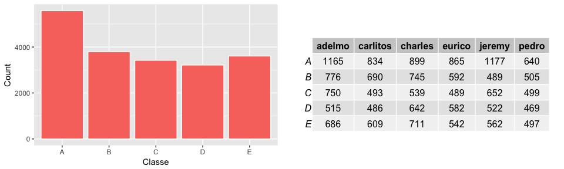
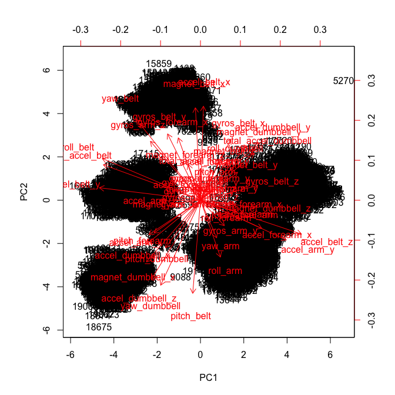
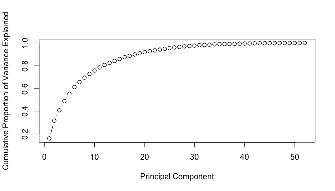
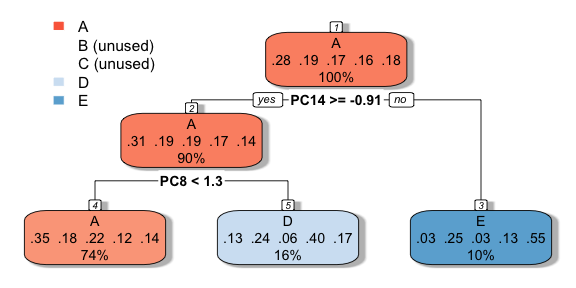

## Summary

In this project, the goal is to use data from accelerometers on the belt, forearm, arm, and dumbell of 6 participants to build a model that accurately predicts *how well* they did a weight lifting exercise (categorical 'classe' variable).

A classification tree is built that yields very low accuracy (37%), compared to a random forest model that has 98% accuracy. To improve runtime performance in random forest, we use parallel processing, and change the default cross validation method used in caret: bootstrapping with 25 samples, to  k-fold cross validation with 5 samples. 

## Loading packages


```r
library(dplyr)
library(ggplot2)
library(gridExtra)
library(RColorBrewer)
library(kableExtra)
library(magrittr)
library(caret)
library(xtable)
library(rpart)
library(rpart.plot)
library(parallel)
library(doParallel)
```

## The Data

The data for this project come from this [source](http://groupware.les.inf.puc-rio.br/har). 

One thing that people regularly do is quantify how much of a particular activity they do, but they rarely quantify how well they do it. This project uses data from accelerometers on the belt, forearm, arm, and dumbell of 6 participants.

### Downloading & importing data  

```r
#creating folder for data
if(!file.exists('project_data')) {
  dir.create('project_data')
}

#downloading train dataset
train_fileURL= 'https://d396qusza40orc.cloudfront.net/predmachlearn/pml-training.csv'
download.file(train_fileURL, destfile = './project_data/train.csv')
train = read.csv('./project_data/train.csv', na.strings=c("", "NA"))

#downloading test dataset
test_fileURL = 'https://d396qusza40orc.cloudfront.net/predmachlearn/pml-testing.csv'
download.file(test_fileURL, destfile = './project_data/test.csv')
test = read.csv('./project_data/test.csv', na.strings=c("", "NA"))
```

The training set has 19,622 rows and 160 variables.

```r
dim(train)
```

```
## [1] 19622   160
```

Having a look at the data (won't print outputs due to size),  there's a mix of factor and numeric variables, some NAs and error terms (i.e: "#DIV/0!" from cvs) that we'll need to clean up.

```r
str(train[,1:50])
str(train[,51:100])
str(train[,101:160])
head(train)
```

### Response Variable

Six young health participants were asked to perform one set of 10 repetitions of the Unilateral Dumbbell Biceps Curl in five different ways: exactly according to the specification (Class A), throwing the elbows to the front (Class B), lifting the dumbbell only halfway (Class C), lowering the dumbbell only halfway (Class D) and throwing the hips to the front (Class E).  

Class (*'classe'* in the data set) will be the outcome variable we're trying to predict.

**Number of observations by Class & Particpant**  
<!-- -->

As per Velloso *et al.*: *"For feature extraction we used a sliding window approach with different lengths from 0.5 second to 2.5 seconds, with 0.5 second overlap. In each step of the sliding window approach we calculated features on the Euler angles (roll, pitch and yaw), as well as the raw accelerometer, gyroscope and magnetometer readings. For the Euler angles of each of the four sensors we calculated eight features: mean, variance, standard deviation, max, min, amplitude, kurtosis and skewness, generating in total 96 derived feature sets."*

### Missing Data

In total, there are 100 variables with NAs in our training set, all of which are missing the bulk of data (19,216). Upon closer inspection, it's clear that these columsn are summaries of other rows related to changes in the window of observations (new_window variable - example below). 

**NA count per column** 

```r
missing = sort(sapply(train, function(x) sum(is.na(x))))
missing[missing>0]
```

```
##       kurtosis_roll_belt      kurtosis_picth_belt        kurtosis_yaw_belt 
##                    19216                    19216                    19216 
##       skewness_roll_belt     skewness_roll_belt.1        skewness_yaw_belt 
##                    19216                    19216                    19216 
##            max_roll_belt           max_picth_belt             max_yaw_belt 
##                    19216                    19216                    19216 
##            min_roll_belt           min_pitch_belt             min_yaw_belt 
##                    19216                    19216                    19216 
##      amplitude_roll_belt     amplitude_pitch_belt       amplitude_yaw_belt 
##                    19216                    19216                    19216 
##     var_total_accel_belt            avg_roll_belt         stddev_roll_belt 
##                    19216                    19216                    19216 
##            var_roll_belt           avg_pitch_belt        stddev_pitch_belt 
##                    19216                    19216                    19216 
##           var_pitch_belt             avg_yaw_belt          stddev_yaw_belt 
##                    19216                    19216                    19216 
##             var_yaw_belt            var_accel_arm             avg_roll_arm 
##                    19216                    19216                    19216 
##          stddev_roll_arm             var_roll_arm            avg_pitch_arm 
##                    19216                    19216                    19216 
##         stddev_pitch_arm            var_pitch_arm              avg_yaw_arm 
##                    19216                    19216                    19216 
##           stddev_yaw_arm              var_yaw_arm        kurtosis_roll_arm 
##                    19216                    19216                    19216 
##       kurtosis_picth_arm         kurtosis_yaw_arm        skewness_roll_arm 
##                    19216                    19216                    19216 
##       skewness_pitch_arm         skewness_yaw_arm             max_roll_arm 
##                    19216                    19216                    19216 
##            max_picth_arm              max_yaw_arm             min_roll_arm 
##                    19216                    19216                    19216 
##            min_pitch_arm              min_yaw_arm       amplitude_roll_arm 
##                    19216                    19216                    19216 
##      amplitude_pitch_arm        amplitude_yaw_arm   kurtosis_roll_dumbbell 
##                    19216                    19216                    19216 
##  kurtosis_picth_dumbbell    kurtosis_yaw_dumbbell   skewness_roll_dumbbell 
##                    19216                    19216                    19216 
##  skewness_pitch_dumbbell    skewness_yaw_dumbbell        max_roll_dumbbell 
##                    19216                    19216                    19216 
##       max_picth_dumbbell         max_yaw_dumbbell        min_roll_dumbbell 
##                    19216                    19216                    19216 
##       min_pitch_dumbbell         min_yaw_dumbbell  amplitude_roll_dumbbell 
##                    19216                    19216                    19216 
## amplitude_pitch_dumbbell   amplitude_yaw_dumbbell       var_accel_dumbbell 
##                    19216                    19216                    19216 
##        avg_roll_dumbbell     stddev_roll_dumbbell        var_roll_dumbbell 
##                    19216                    19216                    19216 
##       avg_pitch_dumbbell    stddev_pitch_dumbbell       var_pitch_dumbbell 
##                    19216                    19216                    19216 
##         avg_yaw_dumbbell      stddev_yaw_dumbbell         var_yaw_dumbbell 
##                    19216                    19216                    19216 
##    kurtosis_roll_forearm   kurtosis_picth_forearm     kurtosis_yaw_forearm 
##                    19216                    19216                    19216 
##    skewness_roll_forearm   skewness_pitch_forearm     skewness_yaw_forearm 
##                    19216                    19216                    19216 
##         max_roll_forearm        max_picth_forearm          max_yaw_forearm 
##                    19216                    19216                    19216 
##         min_roll_forearm        min_pitch_forearm          min_yaw_forearm 
##                    19216                    19216                    19216 
##   amplitude_roll_forearm  amplitude_pitch_forearm    amplitude_yaw_forearm 
##                    19216                    19216                    19216 
##        var_accel_forearm         avg_roll_forearm      stddev_roll_forearm 
##                    19216                    19216                    19216 
##         var_roll_forearm        avg_pitch_forearm     stddev_pitch_forearm 
##                    19216                    19216                    19216 
##        var_pitch_forearm          avg_yaw_forearm       stddev_yaw_forearm 
##                    19216                    19216                    19216 
##          var_yaw_forearm 
##                    19216
```

**Example: *new_window (yes/no)* vs NAs (*TRUE*) in *max_roll_bell variable***

```
##      
##       FALSE  TRUE
##   no      0 19216
##   yes   406     0
```

In the validation data, we will predict based on observations at a particular time point, so we will later get rid of all the above columns that are summarising one sliding window.

### Cleaning data

As well as summary columns full of NAs, we will get rid of the following that won't be useful in our prediction: 

+ **X**: row numbers
+ **user_name**: we're not interested in the participant identifier
+ **timestamps (all three columns)**: since these can't be replicated, it won't be a useful predictor for future observations (not time series)
+ **new_window**: this column is more indicative of study design and related to summary statistic columns, so we will also omit rows where new_window = 'yes'
+ **num_window**: part of study design and related to timing and order of exerises by subject


```r
train2 = train %>%
  filter(new_window == 'no') %>% 
  select_if(function(x) {!any(is.na(x))}) %>% 
  select(-(X:num_window))
```

Now we have a much smaller dataset with 19,216 rows/observations, and 53 variables (from the original 160). Excluding our categorical outcome 'classe', all other variables are numeric.

```r
dim(train2)
```

```
## [1] 19216    53
```

## Exploratory Analysis: PCA

Running a model with all variables in the dataset will be computationally intensive. Principal component analysis (PCA) is a method of extracting important variables (in form of components) from a large set of variables available in a data set. It extracts low dimensional set of features from a high dimensional data set with the objective of capturing as much information as possible.

First, we remove 'classe' to run PCA on the rest of our numeric variables. Then, we can use prcomp(), which centers/normalizes variables to have mean equals to zero and standard deviation equals to 1.


```r
prin_comp = prcomp(train2 %>% select(-classe) , scale. = T) #remove dependent var & run PCA. By default,  prcomp() centers the variable to have mean equals to zero. With parameter scale. = T, we normalize the variables to have standard deviation equals to 1
```

The following are the resultant principal components. Points that are close together correspond to observations that have similar scores on the components displayed in the plot.

```r
biplot(prin_comp, scale=0)
```

<!-- -->

**Scree plot**  
This scree plot shows that ~30 componenents explain around 98% of the variance in the data set, so we can reduce 53 predictors to 30 without compromising on explained variance to make any modelling more manageable.

```r
pr_var = prin_comp$sdev^2 #computing variance 
prop_varex = pr_var/sum(pr_var) #proportion of variance explained
plot(cumsum(prop_varex), 
     xlab = "Principal Component",
     ylab = "Cumulative Proportion of Variance Explained", 
     type = "b")
```

<!-- -->


```r
sum(prop_varex[1:20]) #91.9% variance explained by first 20 components
sum(prop_varex[1:25]) #95.5% variance explained by first 25 components
sum(prop_varex[1:30]) #97.7% variance explained by first 30 components
```

**Creating new dataset with 30 principal components as predictors**

```r
train_PCA = as.data.frame(prin_comp$x) %>% #make new dataset with principal components
  select(PC1:PC30) %>% #keep only first 30
  mutate(classe = train2$classe)
```

## Modeling: Classifiction Tree & Random Forest

We will run 1) a classificition tree; and 2) a random forest model to predict 'classe', and do some model comparison.

### Classification Tree

A decision tree uses a tree structure to represent a number of possible deision paths and an outcome for each path - since our outcome variable is categorical, we will fit a classification tree.

**Creating a validation dataset**

```r
set.seed(123)
inTraining = createDataPartition(train_PCA$classe, p=0.75,list=FALSE) #creates a stratified random sample of the data
train_PCA2 = train_PCA[inTraining,]
validation_PCA = train_PCA[-inTraining,]
```

**Fitting the model**

```r
fit_ct = train(classe ~., method='rpart',data=train_PCA2)
```

**Evaluate model**  
The parameter “cp” in the output represents the degree of complexity, where the tree with highest accuracy had the smallest value of cp. The accucay for this model is still very low (37%).


```r
fit_ct
```

```
## CART 
## 
## 14414 samples
##    30 predictor
##     5 classes: 'A', 'B', 'C', 'D', 'E' 
## 
## No pre-processing
## Resampling: Bootstrapped (25 reps) 
## Summary of sample sizes: 14414, 14414, 14414, 14414, 14414, 14414, ... 
## Resampling results across tuning parameters:
## 
##   cp          Accuracy   Kappa     
##   0.03695441  0.3860676  0.18283208
##   0.06100873  0.3545887  0.11935131
##   0.07303589  0.3063428  0.03365015
## 
## Accuracy was used to select the optimal model using the largest value.
## The final value used for the model was cp = 0.03695441.
```

The final Tree uses two of the pricipal components as predictors, and doesn't appear to be able to predict Class B or C at all. 

```r
rpart.plot(fit_ct$finalModel, box.palette="RdBu", shadow.col="gray", nn=TRUE)
```

<!-- -->

Our confusion matrix shows the average accuracy across resamples (39%) with negligible predictive power on any Class other than A. On our validation data, the accuracy is 39%: as discussed, it can't predict Class B or C, and is only successfully predicting Class A.


```r
confusionMatrix(fit_ct)
```

```
## Bootstrapped (25 reps) Confusion Matrix 
## 
## (entries are percentual average cell counts across resamples)
##  
##           Reference
## Prediction    A    B    C    D    E
##          A 23.9 11.6 13.3  8.1  7.9
##          B  0.5  0.7  0.5  0.6  0.6
##          C  2.1  1.6  2.7  1.1  1.2
##          D  1.5  2.8  0.6  4.5  1.9
##          E  0.6  2.7  0.3  2.0  6.8
##                             
##  Accuracy (average) : 0.3861
```

```r
ctPred = predict(fit_ct, validation_PCA)
confusionMatrix(ctPred, validation_PCA$classe)
```

```
## Confusion Matrix and Statistics
## 
##           Reference
## Prediction    A    B    C    D    E
##          A 1264  614  777  394  496
##          B    0    0    0    0    0
##          C    0    0    0    0    0
##          D   90  185   45  330  118
##          E   13  130   16   62  268
## 
## Overall Statistics
##                                           
##                Accuracy : 0.3878          
##                  95% CI : (0.3739, 0.4017)
##     No Information Rate : 0.2847          
##     P-Value [Acc > NIR] : < 2.2e-16       
##                                           
##                   Kappa : 0.1782          
##  Mcnemar's Test P-Value : NA              
## 
## Statistics by Class:
## 
##                      Class: A Class: B Class: C Class: D Class: E
## Sensitivity            0.9247   0.0000   0.0000  0.41985  0.30385
## Specificity            0.3360   1.0000   1.0000  0.89094  0.94362
## Pos Pred Value         0.3566      NaN      NaN  0.42969  0.54806
## Neg Pred Value         0.9181   0.8065   0.8255  0.88696  0.85764
## Prevalence             0.2847   0.1935   0.1745  0.16368  0.18367
## Detection Rate         0.2632   0.0000   0.0000  0.06872  0.05581
## Detection Prevalence   0.7382   0.0000   0.0000  0.15993  0.10183
## Balanced Accuracy      0.6303   0.5000   0.5000  0.65539  0.62374
```

### Random Forest

In Random Forest, we grow multiple trees as opposed to a single tree above. To classify a new Class based on attributes, each tree gives a classification and each tree “votes” for that class. The forest chooses the classification having the most votes (over all the trees in the forest).

**Improving runtime performance**

Unless something is done to improve response time, running a random forest on our training set is too slow. To improve this we'll take the following steps as suggested by [Len Greski](https://github.com/lgreski/datasciencectacontent/blob/master/markdown/pml-randomForestPerformance.md):

+ **PCA** (as above) - used to reduce the number of predictors.
+ **Parallel processing** - to allow to run models in parallel to obtain a manageable response time. Caret supports the parallel processing capabilities of the parallel package.
+ **Changing resampling method from default of bootstrapping to k-fold cross-validation** - to reduce number of samples against which the model (random forest) is run from 25 to 5, and to change each sample's composition from leave one out to randomly selected training folds.

In his analysis, [Len Greski](https://github.com/lgreski/datasciencectacontent/blob/master/markdown/pml-randomForestPerformance.md) shows that the 5 fold cross-validation resampling technique delivered the same accuracy as the more computationally expensive bootstrapping technique.

**Fitting the model**

```r
set.seed(123)

#Step1: Configure parallel processing
cluster = makeCluster(detectCores() - 1) #convention to leave 1 core for OS
registerDoParallel(cluster)

#Step 2: Configure trainControl object to change resampling method to k-fold cv & sample number to 5
fitControl <- trainControl(method = "cv",
                           number = 5,
                           allowParallel = TRUE)

#Step 3: Develop training model using trainControl() object we just created
fit_rf = train(classe ~., method='rf',data=train_PCA2, trControl=fitControl)

#Step 4: De-register parallel processing cluster 
stopCluster(cluster)
registerDoSEQ()
```

**Evaluate the model**

The random forest model has been able to achieve 97% accuracy with two predictors.


```r
fit_rf
```

```
## Random Forest 
## 
## 14414 samples
##    30 predictor
##     5 classes: 'A', 'B', 'C', 'D', 'E' 
## 
## No pre-processing
## Resampling: Cross-Validated (5 fold) 
## Summary of sample sizes: 11532, 11532, 11532, 11530, 11530 
## Resampling results across tuning parameters:
## 
##   mtry  Accuracy   Kappa    
##    2    0.9722491  0.9648772
##   16    0.9659364  0.9568968
##   30    0.9604554  0.9499749
## 
## Accuracy was used to select the optimal model using the largest value.
## The final value used for the model was mtry = 2.
```

The confusion matrix on resamples shows that it is much better at predicting all Classes (unlike our classification tree).

On our validation data, the accuracy is 98% - we will use this model to predict our sample of 20 observations in our final test set.

```r
confusionMatrix(fit_rf)
```

```
## Cross-Validated (5 fold) Confusion Matrix 
## 
## (entries are percentual average cell counts across resamples)
##  
##           Reference
## Prediction    A    B    C    D    E
##          A 28.3  0.5  0.1  0.1  0.0
##          B  0.1 18.5  0.3  0.0  0.1
##          C  0.1  0.3 16.9  0.8  0.1
##          D  0.0  0.0  0.2 15.5  0.1
##          E  0.0  0.0  0.0  0.0 18.0
##                             
##  Accuracy (average) : 0.9722
```

```r
rfPred = predict(fit_rf, validation_PCA)
confusionMatrix(rfPred, validation_PCA$classe)
```

```
## Confusion Matrix and Statistics
## 
##           Reference
## Prediction    A    B    C    D    E
##          A 1354   16    2    1    0
##          B    5  900    6    0    6
##          C    3    7  821   28    4
##          D    4    0    8  753    4
##          E    1    6    1    4  868
## 
## Overall Statistics
##                                           
##                Accuracy : 0.9779          
##                  95% CI : (0.9734, 0.9819)
##     No Information Rate : 0.2847          
##     P-Value [Acc > NIR] : < 2.2e-16       
##                                           
##                   Kappa : 0.9721          
##  Mcnemar's Test P-Value : NA              
## 
## Statistics by Class:
## 
##                      Class: A Class: B Class: C Class: D Class: E
## Sensitivity            0.9905   0.9688   0.9797   0.9580   0.9841
## Specificity            0.9945   0.9956   0.9894   0.9960   0.9969
## Pos Pred Value         0.9862   0.9815   0.9513   0.9792   0.9864
## Neg Pred Value         0.9962   0.9925   0.9957   0.9918   0.9964
## Prevalence             0.2847   0.1935   0.1745   0.1637   0.1837
## Detection Rate         0.2820   0.1874   0.1710   0.1568   0.1808
## Detection Prevalence   0.2859   0.1910   0.1797   0.1601   0.1833
## Balanced Accuracy      0.9925   0.9822   0.9846   0.9770   0.9905
```

### Making predictions on our test set

**Applying the same data cleaning/transformations on test data**  

```r
problem_id = test$problem_id #saving case id of the 20 observatinos to predict Class for

test2 = test %>%
  filter(new_window == 'no') %>% 
  select_if(function(x) {!any(is.na(x))}) %>% 
  mutate(classe = problem_id) %>% #create classe column 
  select(-(X:num_window), -problem_id)
```

**Transform test data from PCA loadings of train data**

```r
test3 = as.data.frame(predict(prin_comp, newdata = test2 %>%
                                select(-classe))) %>%
  select(PC1:PC30) %>%
  mutate(classe = test2$classe)
```

**Making predictions with our random forest model**  

```r
rfPred_test = as_tibble(predict(fit_rf, test3)) #saving predictions on test data
final_predictions = cbind(problem_id, rfPred_test) 
final_predictions
```

```
##    problem_id value
## 1           1     B
## 2           2     A
## 3           3     B
## 4           4     A
## 5           5     A
## 6           6     E
## 7           7     D
## 8           8     B
## 9           9     A
## 10         10     A
## 11         11     B
## 12         12     C
## 13         13     B
## 14         14     A
## 15         15     E
## 16         16     E
## 17         17     A
## 18         18     B
## 19         19     B
## 20         20     B
```

